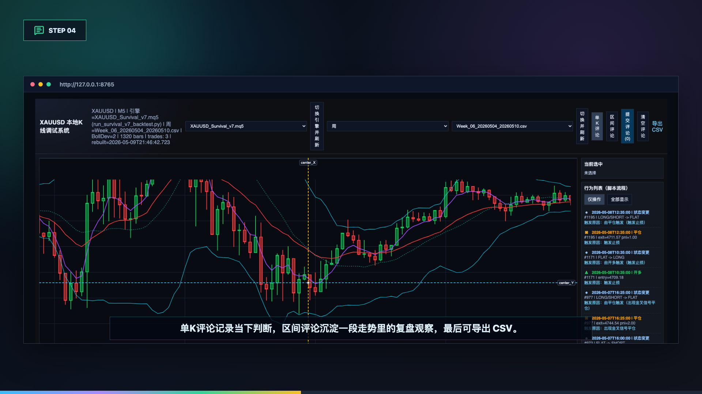
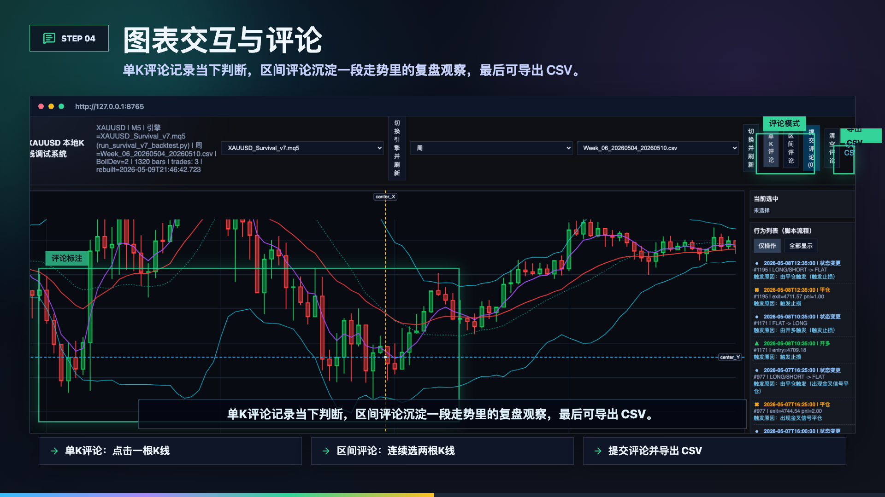

# XAUUSD Local K-Line Debug System

🌐 Language: [简体中文](README.md) | **English**

This project is a local strategy debugging platform for XAUUSD:
visual K-line replay, backtest engine switching, behavior-flow inspection, comments, and stats review.



<video src="preview/xauusd-local-kline-debug-system.mp4" controls width="100%"></video>

---

## Core Features

- Engine switch: choose different `run_survival_v*_backtest.py` in `driver/`
- Dataset switch: load data by `Year / Month / Week / Day`
- Chart debugging: main view + mini map + entry/exit markers + trade lines
- Comment system: single-bar/range comments, batch submit, CSV export
- Review stats: action counts, win rate, TP/SL counts, net PnL, etc.



---

## Quick Start (30 seconds)

### macOS / Linux
```bash
python3 -m venv .venv
source .venv/bin/activate
pip install pandas
cd debug_system
python3 server.py
```

Open in browser: `http://127.0.0.1:8765/`

### Service Management (Recommended)
```bash
cd debug_system
python service_manager.py start
python service_manager.py status
python service_manager.py restart
python service_manager.py stop
```

### Windows (PowerShell)
```powershell
python -m venv .venv
.\.venv\Scripts\Activate.ps1
pip install pandas
cd debug_system
python server.py
```

### Windows (CMD)
```cmd
python -m venv .venv
.venv\Scripts\activate.bat
pip install pandas
cd debug_system
python server.py
```

Open in browser: `http://127.0.0.1:8765/`

---

## Recommended Workflow

1. Select engine: switch strategy profile from top toolbar
2. Select dataset: pick year/month/week/day file
3. Inspect behavior: check entries/exits/state changes on the right panel
4. Add comments: click bars/ranges and submit review notes
5. Review stats: compare outcomes in the bottom stats panel

---

## Directory Overview

- `debug_system/`: web debugger + local HTTP service
- `driver/`: Python backtest engines (default engine source)
- `Year/ Month/ Week/ Day/`: split datasets
- `preview/`: README assets (screenshots and demo video)

---

## Notes

- This repository does **not** include `.mq5` files
- To add a new strategy version, add `driver/run_survival_v*_backtest.py`
